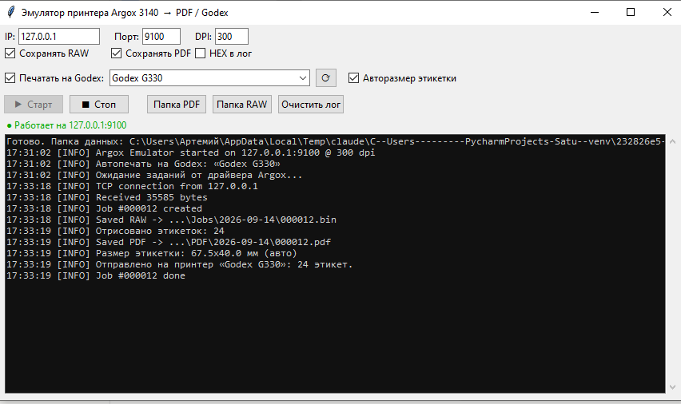

# Эмулятор принтера Argox 3140 → PDF / Godex G330

Сетевой эмулятор термопринтера **Argox 3140**. Притворяется сетевым принтером
(RAW / TCP 9100), принимает задания печати от штатного драйвера Argox,
**распознаёт язык PPLB/EPL2**, рисует каждую этикетку и:

- сохраняет исходный поток задания (`.bin`);
- сохраняет готовую этикетку в **PDF**;
- (по желанию) **автоматически печатает её на принтер Godex G330** через драйвер
  Windows — с автоматической подстановкой размера этикетки под каждое задание.

> Godex понимает язык EZPL, а не PPLB, поэтому на него отправляется не исходный
> поток, а уже отрисованное изображение этикетки через обычный драйвер Windows.
> Конвертация языка не требуется.



## Возможности

- Приём заданий Argox по RAW/TCP 9100 (локально или по сети).
- Разбор PPLB/EPL2: текст (`A`), штрихкоды (`B` — Code128/39/EAN13/EAN8/UPC-A),
  линии и рамки (`LO`/`LE`/`X`), растровая графика (`GW`), формы и сохранённые
  PCX-изображения (`FS`/`FR`/`GM`/`GG`).
- Автоматический разворот под ориентацию печати Argox.
- Рендер в PDF (одна этикетка = одна страница).
- Автопечать на любой принтер Windows (тестировалось с Godex G330) с
  авто-подстановкой размера этикетки по командам `q`/`Q`.
- Графический интерфейс (tkinter) + сборка в один `.exe` (PyInstaller).
- Если поток не распознан — сохраняется RAW и PDF с HEX-дампом (ничего не теряется).

## Требования

- Windows, Python 3.10+
- Зависимости: см. [`requirements.txt`](requirements.txt)
  ```
  pip install -r requirements.txt
  ```
  (`Pillow`, `python-barcode`, `pywin32` — последний нужен только для печати.)

## Запуск

Графический интерфейс:

```
python argox_gui.py
```

Или без окна (консольный сервер):

```
python argox_emulator.py --ip 127.0.0.1 --port 9100 --dpi 300
```

Перегнать ранее захваченный дамп в PDF без сервера:

```
python argox_emulator.py --render job.bin
```

## Настройка драйвера Argox

В свойствах принтера Argox → «Порты» → добавить **Standard TCP/IP Port**:
IP — адрес машины с эмулятором (локально `127.0.0.1`), протокол **RAW**, порт **9100**.

## Сборка `.exe`

```
pyinstaller --noconfirm --onefile --windowed --name ArgoxEmulator ^
    --collect-all barcode --collect-all PIL ^
    --hidden-import win32print --hidden-import win32ui ^
    --hidden-import win32gui --hidden-import win32con ^
    --hidden-import PIL.ImageWin ^
    argox_gui.py
```

Готовый `ArgoxEmulator.exe` самодостаточен — Python на целевой машине не нужен.
Рядом с ним создаются папки `Jobs/`, `PDF/`, `Logs/` и файл `config.json`.

## Настройки (`config.json`)

Создаётся автоматически при первом запуске (образец — [`config.sample.json`](config.sample.json)).
Ключевые параметры:

| Параметр | Назначение |
|---|---|
| `listen_ip` / `port` | адрес и порт приёма (по умолчанию `127.0.0.1:9100`) |
| `dpi` | разрешение (Argox 3140 / Godex G330 = 300) |
| `save_raw` / `save_pdf` | сохранять `.bin` / `.pdf` |
| `forward_to_printer` | автопечать на принтер |
| `printer_name` | имя принтера Windows (напр. `Godex G330`) |
| `auto_label_size` | подстраивать размер этикетки под каждое задание |
| `printer_rotate_deg` | доп. поворот при печати (0/90/180/270) |
| `rotate_output_deg` | разворот итоговой этикетки для читаемого вида (обычно 180) |

## Структура

```
argox_emulator.py   — движок: сервер, парсер PPLB/EPL2, рендер, печать
argox_gui.py        — графический интерфейс (tkinter)
argox_capture.py    — упрощённый вариант: только захват RAW (первый этап)
docs/               — скриншот интерфейса
```

## Лицензия

[MIT](LICENSE)
